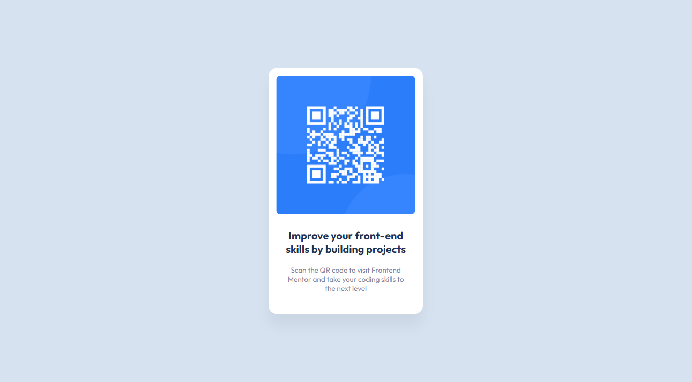

# QR code component

This is my solution to the [QR code component challenge on Frontend Mentor](https://www.frontendmentor.io/challenges/qr-code-component-iux_sIO_H)

## Table of contents

- [Overview](#overview)
  - [The challenge](#the-challenge)
  - [Screenshot](#screenshot)
  - [Links](#links)
- [My process](#my-process)
  - [Built with](#built-with)
- [Author](#author)
- [Acknowledgments](#acknowledgments)

## Overview

### The challenge

- Build a page looking as close as possible to the [original design](./design/desktop-design.jpg)

### Screenshot

### Links

You can see a working version at [https://mateus3009.github.io/QR-code-component/](https://mateus3009.github.io/QR-code-component/)

## My process

### Built with

- HTML
- CSS

## Author

 - Frontend Mentor - [@mateus3009](https://www.frontendmentor.io/profile/mateus3009)
 - LinkedIn - [Mateus Sales albino](https://www.linkedin.com/in/mateusalbino/)

## Acknowledgments

Thank you for checking out my project!
